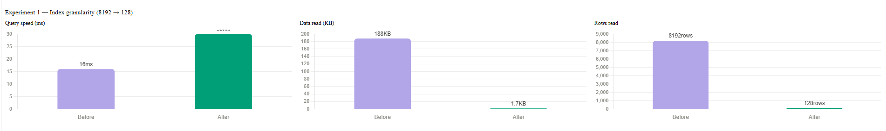
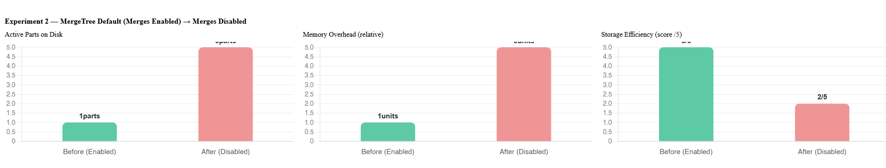
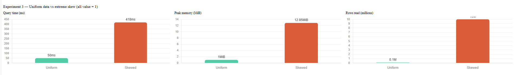
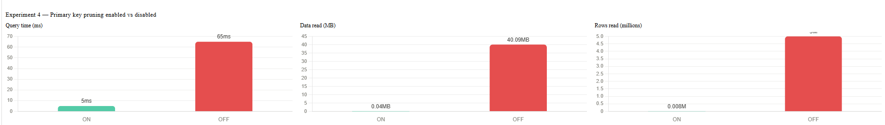

# Open ClickHouse's MergeTree Engine


> Not a tutorial. Not documentation. A reverse-engineering journal of how one of the world's fastest database engines actually works — from source code to broken experiments.

---

## What is MergeTree?

MergeTree is the default storage engine of ClickHouse — one of the fastest analytical databases in the world. It is designed for processing hundreds of millions to billions of rows per second.

It is built around three core principles:

| Principle | What It Means |
|-----------|---------------|
| **Immutable Parts** | Every `INSERT` creates a new folder on disk. Data is never modified in place — updates rewrite the entire block. |
| **Sparse Primary Index** | One index entry is stored for every 8,192 rows instead of every row. The entire index for 1 billion rows fits in just ~1 MB of RAM. |
| **Background Merges** | Small parts created by inserts are continuously merged into larger ones by background workers, keeping read performance fast. |

---

## What We Actually Did

### Phase 1 — Read the Source Code

We analyzed the `src/Storages/MergeTree/` directory of the ClickHouse source and traced two critical code paths:

- **The INSERT path:** SQL Parser → Interpreter → Sort Block by ORDER BY → Write Columns to `.bin` / `.mrk` → Atomic Rename to Active Part
- **The SELECT path:** SQL Parser → Load Sparse Index → Binary Search via `KeyCondition` → Read Granules → Decompress → Filter Rows → Return Result

Every function call, file handoff, and design decision is documented in [`code-notes/`](code-notes/).

### Phase 2 — Break Things on Purpose

We modified the ClickHouse C++ source directly to disable or alter core engine behaviors, then measured the impact on query performance using `system.query_log`.

| Experiment | Source File Modified | What We Changed |
|---|---|---|
| **Exp 1: Index Granularity** | `MergeTreeSettings.cpp` | Changed default `index_granularity` from `8192` → `128` |
| **Exp 2: Disable Merges** | `MergeTreeDataMergerMutator.cpp` | Modified the error message in `selectPartsToMerge()` to trace the experiment — merges were blocked by running `SYSTEM STOP MERGES` |
| **Exp 3: Data Skew** | *(No code change)* | Inserted 10M rows all with `value = 1` (identical primary key) |
| **Exp 4: Disable PK Pruning** | `MergeTreeDataSelectExecutor.cpp` | Hardcoded `key_condition_useful = false` in `markRangesFromPKRange()` |

### Phase 3 — The Autopsy

Every surprising result was traced back to the exact C++ function that caused it. Every apparent "bug" turned out to be a deliberate design trade-off, documented in [`code-notes/concept_mapping.md`](code-notes/concept_mapping.md).

---

## Repository Structure

```
ClickHouse-MergeTree-Project/
│
├── 📁 raw/                              # ClickHouse source code (cloned via submodule)
│   └── ClickHouse/
│       └── src/Storages/MergeTree/      # The C++ source files we analyzed
│
├── 📁 code-notes/                       # Our analysis and documentation
│   ├── concept_mapping.md               # 20+ concepts mapped to source files
│   ├── design_decisions.md              # Why ClickHouse made each architectural choice
│   ├── execution_flow.md                # INSERT and SELECT code paths, step by step
│   └── failure_analysis.md              # Failure modes mapped to source code
│
├── 📁 experiments/
│   ├── exp1_granularity/
│   │   └── exp_granularity.md           # Granularity 128 vs 8192 — full report
│   ├── exp2_merge_disable/
│   │   └── exp2_merge_disable.md        # Background merge disabling — full report
│   ├── exp3_code_mod/
│   │   └── exp3_data_skew.md            # Data skew with identical key values — full report
│   └── exp4_primary_key_disable/
│       └── exp4_primary_key_disable.md  # Primary key pruning disabled — full report
│
├── 📁 diagrams/
│   └── execution_pipeline.md            # Full write → merge → read pipeline diagram
│
├── 📁 Screenshots/
│   └── Visualization/                   # Chart images for each experiment result
│
└── README.md
```

---

## Source Code Changes — What We Modified and Why

This table summarizes every modification made to the ClickHouse C++ source during the project.

| File | Location in Source | Original Behavior | Our Modification | Experiment |
|------|--------------------|-------------------|------------------|------------|
| `MergeTreeSettings.cpp` | `src/Storages/MergeTree/` | `DECLARE(UInt64, index_granularity, 8192, ...)` — default granularity is 8192 rows per index mark | Changed the value to `128` so the compiled binary creates one index mark per 128 rows by default | **Exp 1** |
| `MergeTreeDataMergerMutator.cpp` | `src/Storages/MergeTree/` | `selectPartsToMerge()` selects candidate parts and returns merge failure with message `"No parts satisfy preconditions for merge"` | Changed the failure explanation message to `"Background merges disabled for experiment"` to identify the blocked merge path; background merges were also stopped via `SYSTEM STOP MERGES` | **Exp 2** |
| `MergeTreeDataSelectExecutor.cpp` | `src/Storages/MergeTree/` | `bool key_condition_useful = !key_condition.alwaysUnknownOrTrue();` — evaluates the WHERE clause to decide if the sparse index can prune granules | Hardcoded to `bool key_condition_useful = false;` inside `markRangesFromPKRange()`, forcing the engine to skip all index evaluation and read every granule | **Exp 4** |

---

## System Requirements

>  **Warning:** Building ClickHouse from source requires significant resources. If you only want to run Experiment 3 (data skew — no code change), use the stock Docker image.

| Component | Requirement |
|-----------|-------------|
| Operating System | Linux (Ubuntu 20.04+) or macOS. Windows users should use **WSL2**. |
| RAM | Minimum 6 GB; 8 GB or more strongly recommended for building |
| Disk Space |**~70 GB** free (ClickHouse source + build artifacts + experiment data) |
| Tools | `git`, `cmake`, `ninja`, `clang-14` |
| Build Time | Initial build time takes around **12-14 hr** and after that approximately **45–60 minutes** on each build |


## Clone the Repository

```bash
# Clone this project
git clone https://github.com/GaUrAnGjJ/ClickHouse-MergeTree-Project.git
cd ClickHouse-MergeTree-Project

# Initialize and pull the ClickHouse source submodule
# This step can take 12–14 hours depending on your internet speed
git submodule update --init --recursive
```

---

## Build Instructions

> These steps are required only if you want to reproduce **Experiments 1, 2, or 4**, which involve modifying the ClickHouse C++ source code.

```bash
# Step 1 — Install build dependencies (Ubuntu)
sudo apt-get install -y cmake ninja-build clang-14 libssl-dev

# Step 2 — Navigate into the ClickHouse source directory
cd raw/ClickHouse

# Step 3 — Apply the source code modification for your chosen experiment
# (See each experiment's report file for the exact lines to change)

# Step 4 — Create the build directory and compile
mkdir -p build && cd build
cmake .. -DCMAKE_BUILD_TYPE=RelWithDebInfo -G Ninja
ninja clickhouse-server clickhouse-client
```

> **Important:** Before building for a new experiment, revert any changes from the previous one to avoid interference between results.
> ```bash
> git checkout -- src/Storages/MergeTree/
> ```

---

## Run Locally

```bash
# Start the custom-built ClickHouse server
./clickhouse server --config-file=/etc/clickhouse-server/config.xml &

# Connect to the server using the client
clickhouse-client --host 127.0.0.1 --port 9000

# Verify the server is running
SELECT version();
```


---

## Running Each Experiment

Full SQL scripts, exact terminal output, and conclusions are documented in each experiment's report file.

| Experiment | Report File | What Was Tested |
|---|---|---|
| **Exp 1: Index Granularity** | [`exp_granularity.md`](experiments/exp1_granularity/exp_granularity.md) | Custom binary with `index_granularity = 128`. Point query on `id = 777777` in a 10M-row table. Compared `read_rows`, `read_bytes`, and `query_duration_ms` between granularity 128 and 8192. |
| **Exp 2: Disable Merges** | [`exp2_merge_disable.md`](experiments/exp2_merge_disable/exp2_merge_disable.md) | Background merges disabled. 5 separate inserts created 5 unmerged parts. Confirmed accumulation via `system.parts`, then recovered using `OPTIMIZE TABLE merge_exp.parts_test FINAL`. |
| **Exp 3: Data Skew** | [`exp3_data_skew.md`](experiments/exp3_code_mod/exp3_data_skew.md) | Inserted 10M rows with `value = 1` into a table ordered by `value`. Query `WHERE value = 1` read all 10M rows — zero granule pruning despite the index existing. |
| **Exp 4: Disable PK Pruning** | [`exp4_primary_key_disable.md`](experiments/exp4_primary_key_disable/exp4_primary_key_disable.md) | Custom binary with `key_condition_useful = false`. Point query `WHERE id = 4242424` on a 5M-row table. Read 5,000,000 rows and 40 MB to return 1 result row. |

---

## Experiment Results

<br/>

**Exp 1 — Index Granularity (128 vs 8192)**


<br/>

**Exp 2 — Background Merges Disabled**


<br/>

**Exp 3 — Data Skew (identical primary key values)**


<br/>

**Exp 4 — Primary Key Pruning Disabled**


---

## Failure Analysis

### Build conflicts between experiments

Each experiment requires a different source code modification. Before rebuilding for a new experiment, revert all previous changes:

```bash
cd raw/ClickHouse
git checkout -- src/Storages/MergeTree/
```

### Query log shows no data

ClickHouse writes query logs asynchronously. Flush them manually before querying:

```sql
SYSTEM FLUSH LOGS;

SELECT read_rows, query_duration_ms
FROM system.query_log
WHERE type = 'QueryFinish'
ORDER BY event_time DESC
LIMIT 5;
```

### Query results appear cached (numbers don't change between runs)

Drop the mark and uncompressed caches before each benchmark run:

```sql
SYSTEM DROP MARK CACHE;
SYSTEM DROP UNCOMPRESSED CACHE;
```

### Wrong working directory during build

- Source file edits must be made inside `raw/ClickHouse/src/Storages/MergeTree/`
- The `ninja` build command must be run from inside `raw/ClickHouse/build/`
- Do not edit files inside the `build/` directory — those are generated files

---

## Numbers That Surprised Us

| Finding | Value | Experiment |
|---------|-------|------------|
| Rows read for 1 result (granularity 128) | **128 rows** | Exp 1 — `test_fine`, `id = 777777` |
| Bytes read for 1 result (granularity 128) | **~1.7 KB** | Exp 1 — vs 188 KB with default granularity |
| Rows read for 1 result (granularity 8192) | **8,192 rows** | Exp 1 — `test_coarse`, `id = 777777` |
| Query slower with smaller granularity | **30 ms vs 16 ms (1.9× slower)** | Exp 1 — more index marks = more binary search hops |
| Active parts after inserts with merges disabled | **5 parts** | Exp 2 — `merge_exp.parts_test` |
| Active parts after `OPTIMIZE TABLE FINAL` | **1 part** | Exp 2 — merged back in 0.017 sec |
| Rows read with identical key (10M rows) | **10,000,000 (full scan)** | Exp 3 — zero granule pruning |
| Granules pruned on skewed data | **0** | Exp 3 — index exists but cannot eliminate anything |
| Rows read to return 1 result (PK pruning off) | **5,000,000** | Exp 4 — `pruning_exp.pk_test`, `id = 4242424` |
| Bytes read to return 1 result (PK pruning off) | **40 MB** | Exp 4 — full table scan |
| Query duration with PK pruning off | **65 ms** | Exp 4 — vs sub-millisecond with pruning on |

---

## Conclusion

This project reverse-engineered the ClickHouse MergeTree engine by reading 305 source files, modifying three core C++ functions, and running four controlled experiments. Each experiment was designed to isolate and expose one fundamental architectural property of the engine.

| Experiment | Property Exposed | Observed Impact |
|---|---|---|
| Exp 1: Index Granularity | Granule is the minimum I/O unit | Changing 8192 → 128 reduced bytes read by 99% but made queries 1.9× slower |
| Exp 2: Disable Merges | Part count directly controls query cost | 5 unmerged parts accumulated — `OPTIMIZE TABLE FINAL` reduced them back to 1 |
| Exp 3: Data Skew | Index utility depends on data cardinality | 10M rows with identical key read all 10M rows — 0 granules pruned |
| Exp 4: PK Pruning Disabled | Sparse index is the foundation of read performance | 5M-row full scan (40 MB, 65 ms) to return 1 row |

MergeTree's performance is not magic — it is the product of three tightly coupled mechanisms: immutable sorted parts, a sparse index for granule pruning, and background merges to control part count. When any one of these breaks, performance degrades measurably and predictably. Every "limitation" we found turned out to be a deliberate trade-off.

---

## Tech Stack, Authors & Mentor

### Tech Stack

| Component | Details |
|-----------|---------|
| Database Engine | ClickHouse (built from source) |
| Deployment | Docker (`linux/amd64`) |
| Build System | CMake 3.20+ · Ninja · Clang 14 |
| Documentation | Markdown · Mermaid diagrams |
| Query Analysis | ClickHouse SQL client · `system.query_log` |

### Authors

**Gaurang Jadav & Het Katrodiya**  
Big Data Engineering — DA-IICT, Semester 2

### Mentor

**Prof. Ankush Chander**
