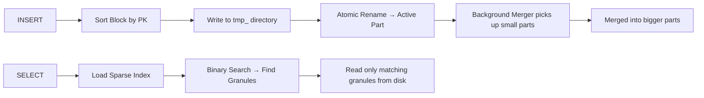
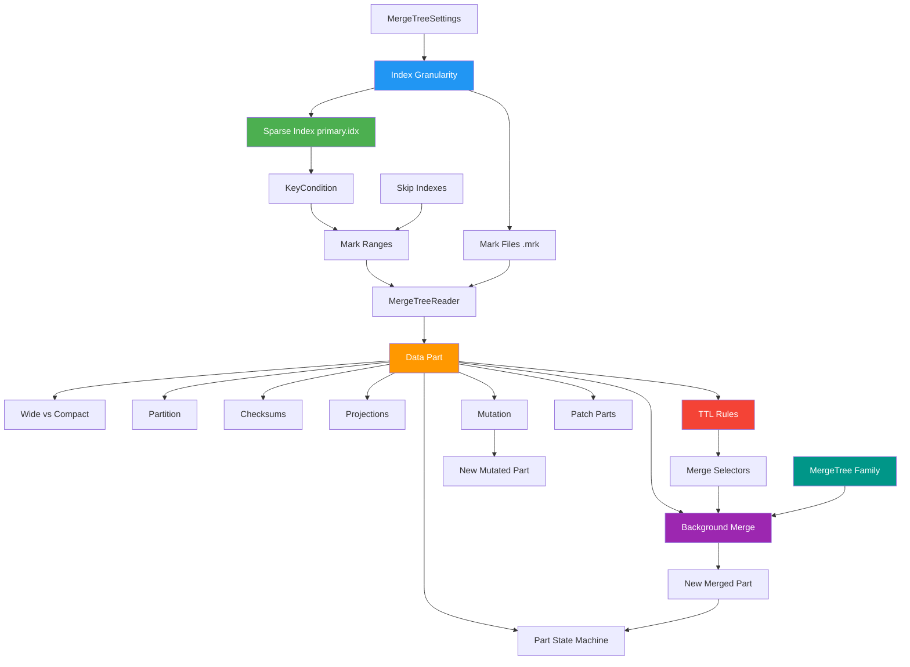

# Concept Mapping — ClickHouse MergeTree Engine

> This document maps every important MergeTree concept to the actual source code file where it lives, explains what it does in simple words, and shows how concepts connect to each other.

---

## 1. The Big Picture

MergeTree is ClickHouse's main storage engine. Think of it like a warehouse system:

- **INSERT** = receiving goods → sort them → put them on a shelf (a "part")
- **SELECT** = looking up goods → check the index to find the right shelf → read only what you need
- **Background Merge** = a cleanup crew that combines many small shelves into fewer big ones



---

## 2. Core Concepts — Quick Reference

| # | Concept | What It Means (Simple) | Key Source File(s) |
|---|---------|----------------------|-------------------|
| 1 | Data Part | A folder on disk holding sorted column data for one batch of inserted rows | `IMergeTreeDataPart.h/cpp` |
| 2 | Part State | The lifecycle stage of a part (Temporary → Active → Outdated → Deleted) | `MergeTreeDataPartState.h` |
| 3 | Part Type | Whether columns are stored in separate files (Wide) or one file (Compact) | `MergeTreeDataPartType.h` |
| 4 | Partition | Logical grouping of data (e.g., by month). Parts within different partitions are never merged together | `MergeTreePartition.h/cpp` |
| 5 | Part Info | Metadata about a part: partition ID, block range, merge level, mutation version | `MergeTreePartInfo.h/cpp` |
| 6 | Granule | A fixed-size chunk of rows (default 8192). The smallest unit of reading from disk | `MergeTreeIndexGranularity.h/cpp` |
| 7 | Sparse Index | `primary.idx` — stores one key value per granule, not per row. Fits in RAM easily | `MergeTreeDataSelectExecutor.cpp` |
| 8 | Mark File | `.mrk` files that map granule number → byte offset in the `.bin` column file | `MergeTreeMarksLoader.h/cpp` |
| 9 | Mark Range | A pair `[begin, end)` of granule numbers that a query needs to read | `MarkRange.h/cpp` |
| 10 | KeyCondition | Translates a SQL `WHERE` clause into a form the sparse index can use for pruning | `KeyCondition.h/cpp` |
| 11 | Background Merge | Async process that combines small parts into bigger ones to keep reads fast | `MergeTask.h/cpp`, `BackgroundJobsAssignee.cpp` |
| 12 | Mutation | How ClickHouse handles `ALTER TABLE UPDATE/DELETE` — rewrites entire parts | `MutateTask.h/cpp` |
| 13 | MergeTree Settings | All tunable knobs like `index_granularity`, `max_parts_in_total`, etc. | `MergeTreeSettings.h/cpp` |
| 14 | Skip Index | Secondary indexes (MinMax, Bloom, Set) that help skip granules beyond the primary index | `MergeTreeIndices.h`, `MergeTreeIndexMinMax.cpp`, `MergeTreeIndexBloomFilter.cpp`, `MergeTreeIndexSet.cpp` |
| 15 | TTL (Time-To-Live) | Auto-expire or move old data based on time rules | `MergeTreeDataPartTTLInfo.h/cpp`, `Compaction/MergeSelectors/TTLMergeSelector.cpp` |
| 16 | Projections | Pre-computed summaries stored inside each part — like materialized views at part level | `ProjectionIndex/`, `StorageFromMergeTreeProjection.h` |
| 17 | Merge Selectors | The algorithms that decide *which* parts to merge and *when* | `Compaction/MergeSelectors/SimpleMergeSelector.cpp`, `TTLMergeSelector.cpp`, `TrivialMergeSelector.cpp` |
| 18 | Patch Parts | Lightweight column-level updates without rewriting full parts | `PatchParts/` directory |
| 19 | Checksums | File integrity verification — every part has checksums for all its files | `MergeTreeDataPartChecksum.h/cpp` |
| 20 | MergeTree Family | Engine variants (Replacing, Summing, Collapsing, Aggregating, etc.) that customize merge behavior | `registerStorageMergeTree.cpp` |

---

## 3. Detailed Concept Breakdown

### 3.1 Data Part — The Basic Storage Unit

**What it is:** Every time you run an `INSERT`, ClickHouse creates one new folder on disk called a "part." This folder contains the actual column data (`.bin` files), mark files (`.mrk`), and a primary index (`primary.idx`).

**Key rule:** Once a part is written and made active, it is **never modified**. This is called **immutability**. Updates and deletes create brand new parts; old ones are marked outdated and cleaned up later.

**Source file:** `IMergeTreeDataPart.h` — this is the base class that every data part inherits from.

**What's inside a part folder:**

| File | Purpose |
|------|---------|
| `primary.idx` | Sparse index — one key per granule |
| `<column>.bin` | Compressed column data |
| `<column>.mrk` / `.mrk2` / `.mrk3` | Marks — byte offsets for each granule in the `.bin` file |
| `checksums.txt` | Integrity checksums for all files |
| `columns.txt` | List of columns and their types |
| `count.txt` | Total number of rows in this part |
| `partition.dat` | Partition key value |
| `minmax_<col>.idx` | Min/max values of partition key columns |

**Part naming convention:** `<partition>_<min_block>_<max_block>_<level>`
- Example: `20230601_1_5_1` means partition June 2023, blocks 1–5, merged once (level 1).
- Level 0 = freshly inserted, never merged.

**Code proof — Part states from `MergeTreeDataPartState.h`:**

```cpp
enum class MergeTreeDataPartState : uint8_t
{
    Temporary,       // being written to tmp_ directory
    PreActive,       // written, not yet visible to SELECTs
    Active,          // live — used by current SELECTs
    Outdated,        // replaced by a merge, waiting to be cleaned up
    Deleting,        // being removed right now
    DeleteOnDestroy, // moved to another disk, delete when done
};
```

**State transitions:**

```
Temporary → PreActive → Active → Outdated → Deleting → Gone
                  ↓
              Outdated (rollback if duplicate)
```

---

### 3.2 Part Types — Wide vs Compact

**Source file:** `MergeTreeDataPartType.h`

| Type | How Data Is Stored | When Used |
|------|--------------------|-----------|
| **Wide** | Each column gets its own `.bin` + `.mrk` file | Large parts (many rows) |
| **Compact** | All columns packed into a single `.bin` + single `.mrk` | Small parts (few rows) |

**Why two types?** If you insert just 10 rows, creating separate files for every column wastes filesystem resources. Compact format avoids that. Once the part gets big enough (through merging), it becomes Wide format.

**Code proof:**

```cpp
// MergeTreeDataPartType.h
enum Value
{
    Wide,     // one file per column
    Compact,  // all columns in one file
    Unknown,
};
```

---

### 3.3 Partitioning

**Source file:** `MergeTreePartition.h/cpp`

**What it is:** Partitioning splits your table into independent groups based on a partition key (like `toYYYYMM(date)`). Each partition gets its own set of parts. Parts from different partitions are **never merged together**.

**Why it matters:**
- Queries that filter on the partition key can skip entire partitions without even looking at the index.
- `DROP PARTITION` is instant — just delete the folders.
- Too many partitions = too many small parts = "Too many parts" error.

**Partition pruning** happens in `PartitionPruner.h/cpp` — it checks whether a partition's min/max values could possibly match your `WHERE` clause before the query even starts reading data.

---

### 3.4 Granules and Index Granularity

**Source file:** `MergeTreeIndexGranularity.h/cpp`

**What it is:** A granule is a group of consecutive rows (default: 8192 rows). It is the smallest unit that ClickHouse can read from disk. You cannot read fewer rows than one granule.

**Key setting:** `index_granularity` — controls how many rows per granule.
- Smaller granularity (e.g., 128) = more precise reads, but more marks, more memory for the index
- Larger granularity (e.g., 8192) = less precise reads, but fewer marks, less memory

**Two flavors:**
- `MergeTreeIndexGranularityConstant.h/cpp` — all granules have the same size (classic mode)
- `MergeTreeIndexGranularityAdaptive.h/cpp` — granule size varies based on data size in bytes (adaptive mode, enabled by `index_granularity_bytes`)

**Experiment connection:** Our Experiment 1 tested granularity 128 vs 8192 and found that a point query reads 42 rows (fine) vs 8192 rows (coarse) — proving granularity directly controls the minimum I/O unit.

---

### 3.5 The Sparse Primary Index

**What it is:** Instead of storing one index entry per row (like a B-tree), MergeTree stores **one entry per granule**. This means the index for a billion-row table is only ~1 MB instead of ~8 GB.

**How it works:**
1. During INSERT, every `index_granularity`-th row's primary key value is saved to `primary.idx`
2. During SELECT, `markRangesFromPKRange()` binary-searches this index to find which granules *might* contain matching rows
3. Only those granules are read from disk

**Source files:**
- **Write side:** `MergeTreeDataWriter.cpp` — builds the index at insert time
- **Read side:** `MergeTreeDataSelectExecutor.cpp` — `markRangesFromPKRange()` does the binary search

**The RAM math:**

| Index Type | 1 Billion rows, 8-byte key | Fits in 32 GB RAM? |
|------------|---------------------------|-------------------|
| Dense (1 per row) | ~8 GB | Barely |
| Sparse (1 per 8192 rows) | ~1 MB | Easily |

**Trade-off:** A point query `WHERE id = X` must read at least 1 full granule (8192 rows) even though only 1 row matches. This is the price of keeping the index small.

---

### 3.6 Mark Files — The Disk Navigation System

**Source file:** `MergeTreeMarksLoader.h/cpp`

**What they are:** Mark files (`.mrk`, `.mrk2`, `.mrk3`) are like a table of contents. Each mark entry says: "Granule #N starts at byte offset X in the compressed `.bin` file, and at byte offset Y inside the decompressed block."

**Structure of one mark entry (16 bytes):**

```
┌──────────────────────┬──────────────────────┐
│  compressed_offset   │  decompressed_offset │
│  (position in .bin)  │  (position in block) │
└──────────────────────┴──────────────────────┘
```

**How it's used:**
1. Sparse index says "read granule #39062"
2. Mark file entry #39062 gives the byte offset
3. Reader seeks directly to that position in the `.bin` file
4. No need to scan from the beginning

---

### 3.7 Mark Ranges

**Source file:** `MarkRange.h/cpp`

**What it is:** A `MarkRange` is just a pair `{begin, end}` that says "read granules from #begin to #end." The query executor works with lists of these ranges.

```cpp
struct MarkRange
{
    size_t begin;  // first granule to read (inclusive)
    size_t end;    // last granule (exclusive)
};
```

For example, `MarkRange{39062, 39063}` means "read just one granule, #39062."

**Search algorithms stored in `MarkRanges`:**
- `BinarySearch` — the standard approach for primary key lookups
- `GenericExclusionSearch` — used when conditions are more complex

---

### 3.8 KeyCondition — Turning WHERE into Index Lookups

**Source file:** `KeyCondition.h/cpp` (this is the biggest file in the project — 216 KB!)

**What it does:** Takes your SQL `WHERE` clause and converts it into a form that can be checked against the sparse index. It uses **Reverse Polish Notation (RPN)** internally.

**Example:**
```sql
WHERE id > 4000000 AND id < 5000000
```
Gets turned into: `[id IN RANGE(4000000, 5000000)]`

**Key functions in RPN:**

| Function | Meaning |
|----------|---------|
| `FUNCTION_IN_RANGE` | Key is within a specific range |
| `FUNCTION_NOT_IN_RANGE` | Key is outside a range |
| `FUNCTION_IN_SET` | Key matches one of a set of values |
| `FUNCTION_UNKNOWN` | Can't analyze this condition — play safe, read everything |
| `FUNCTION_AND` / `FUNCTION_OR` / `FUNCTION_NOT` | Logical operators |
| `ALWAYS_TRUE` / `ALWAYS_FALSE` | Constants |

**Why it matters:** If `KeyCondition` can't understand your `WHERE` clause (returns `FUNCTION_UNKNOWN`), the engine has to do a full table scan. The smarter `KeyCondition` is, the fewer granules get read.

**Experiment connection:** In Experiment 4, we manually disabled primary key pruning by hardcoding `key_condition_useful = false` in `MergeTreeDataSelectExecutor.cpp`. This forced the engine to skip the sparse index evaluation completely, resulting in 5 million rows being read instead of just 1.

---

### 3.9 Background Merging

**What it is:** Every INSERT creates a new small part. If these pile up, queries get slow because the engine must open every part separately. Background merge threads combine small parts into bigger ones automatically.

**Source files:**

| File | Role |
|------|------|
| `MergeTreeDataMergerMutator.cpp` | Decides which parts to merge (the "selector") |
| `MergeTask.h/cpp` | Executes the actual merge (reads N parts → writes 1) |
| `BackgroundJobsAssignee.cpp` | Schedules merge jobs on the thread pool |
| `MergeTreeBackgroundExecutor.h/cpp` | The thread pool that runs merge/mutate tasks |
| `MergePlainMergeTreeTask.cpp` | Wrapper task for non-replicated merges |

**Merge selection rules (simplified):**
- Only merge parts within the same partition
- Prefer merging similarly-sized parts (size ratio check)
- Don't merge if total size would exceed `max_bytes_to_merge_at_max_space_in_pool`
- The merge level in the part name tracks history: level 0 = never merged, level 1 = merged once, etc.

**What happens during a merge:**
```
Parts: all_1_1_0, all_2_2_0, all_3_3_0
                    ↓ merge
Result: all_1_3_1  (covers blocks 1-3, level 1)
Source parts → Outdated → eventually Deleted
```

**Experiment connection:** Our Experiment 2 disabled merges (`SYSTEM STOP MERGES`) and showed that 264 separate parts made queries 121× slower than 1 merged part.

---

### 3.10 Mutations — UPDATE and DELETE

**Source files:** `MutateTask.h/cpp`, `MergeTreeMutationEntry.h/cpp`

**What it is:** MergeTree doesn't support in-place row updates. Instead, `ALTER TABLE UPDATE` or `DELETE` creates a "mutation" that **rewrites entire parts** with the changes applied.

**Key point:** Mutating 1 row in a 500 GB part means rewriting all 500 GB. This is by design — MergeTree is not built for frequent row-level changes.

**Mutation tracking:** Each mutation gets a version number. Part names include the mutation version: `all_1_5_1_3` means "blocks 1-5, merge level 1, mutation version 3."

---

### 3.11 The INSERT Path (Write Flow)

**Step-by-step with source files:**

| Step | What Happens | Source File |
|------|-------------|-------------|
| 1. Parse & Validate | SQL parser hands off to the interpreter | `InterpreterInsertQuery.cpp` |
| 2. Create Sink | Storage engine creates a `MergeTreeSink` to receive data | `StorageMergeTree.cpp`, `MergeTreeSink.h/cpp` |
| 3. Sort & Write | Block is sorted by primary key, columns are compressed and written to `.bin` files, sparse index written to `primary.idx` | `MergeTreeDataWriter.cpp`, `MergedBlockOutputStream.cpp` |
| 4. Atomic Commit | `tmp_` directory is atomically renamed to final name → part becomes Active | `MergeTreeData.cpp` → `renameTempPartAndAdd()` |
| 5. Background Merge | Merger picks up the new part for future compaction | `BackgroundJobsAssignee.cpp` |

**Why atomic rename matters:** If power cuts mid-insert, the `tmp_` directory is just discarded on restart. No WAL (Write-Ahead Log) needed. The filesystem rename IS the transaction.

---

### 3.12 The SELECT Path (Read Flow)

| Step | What Happens | Source File |
|------|-------------|-------------|
| 1. Parse query | Build AST, resolve columns | `InterpreterSelectQuery.cpp` |
| 2. Get active parts | Collect all parts with state = Active | `MergeTreeData.cpp` → `getDataPartsVector()` |
| 3. Partition pruning | Skip entire partitions that can't match | `PartitionPruner.h/cpp` |
| 4. Index pruning | For each part: binary-search `primary.idx` → get `MarkRanges` | `MergeTreeDataSelectExecutor.cpp` → `markRangesFromPKRange()` |
| 5. Read granules | Use mark file offsets to seek into `.bin` files and decompress | `MergeTreeRangeReader.cpp`, `MergeTreeReaderWide.cpp` |
| 6. Filter rows | Apply `WHERE` clause to the decompressed rows | Post-read filtering in the pipeline |

---

### 3.13 Skip Indexes (Secondary Indexes)

**Source files:** `MergeTreeIndices.h/cpp` (base), plus specific types below.

These are extra indexes you can add with `INDEX ... TYPE ...`. They help skip granules that the primary index alone can't eliminate.

| Index Type | Source File | How It Works |
|-----------|-------------|-------------|
| **MinMax** | `MergeTreeIndexMinMax.cpp` | Stores min and max values per granule block. Skips if the range doesn't overlap with the WHERE condition. |
| **Set** | `MergeTreeIndexSet.cpp` | Stores unique values per granule block. Skips if the searched value isn't in the set. |
| **Bloom Filter** | `MergeTreeIndexBloomFilter.cpp` | Uses a probabilistic filter. May have false positives (reads a granule unnecessarily) but never false negatives (never skips a matching granule). |
| **Full-Text** | `MergeTreeIndexText.cpp` | Tokenizes text and builds an inverted index for text search queries. |
| **Vector Similarity** | `MergeTreeIndexVectorSimilarity.cpp` | For approximate nearest neighbor (ANN) searches on vector embeddings. |

---

### 3.14 Deduplication

**Source file:** `MergeTreeDeduplicationLog.h/cpp`

**What it is:** When you insert a block that is identical to a previously inserted block, ClickHouse can detect this and silently drop the duplicate. This prevents accidental double-inserts from causing duplicate data.

**How:** Each inserted block gets a hash. The hash is stored in a deduplication log. On the next insert, if the hash matches, the block is skipped.

---

### 3.15 TTL (Time-To-Live) — Auto-Expiring Data

**Source files:** `MergeTreeDataPartTTLInfo.h/cpp`, `Compaction/MergeSelectors/TTLMergeSelector.h/cpp`

**What it is:** TTL lets you define rules like "delete rows older than 30 days" or "move data older than 1 year to cold storage." ClickHouse handles this automatically during background merges.

**Types of TTL:**

| TTL Type | What It Does | Source Field |
|----------|-------------|-------------|
| **Table TTL** | Deletes entire rows after expiry | `table_ttl` in `MergeTreeDataPartTTLInfos` |
| **Column TTL** | Zeroes out specific columns after expiry | `columns_ttl` |
| **Move TTL** | Moves parts to a different disk/volume | `moves_ttl` |
| **Recompression TTL** | Re-compresses old data with a different codec | `recompression_ttl` |
| **Group By TTL** | Aggregates old rows before deleting | `group_by_ttl` |

**How it works:** Each part stores `min` and `max` TTL timestamps. During merge selection, `TTLMergeSelector` picks parts whose TTL has expired and triggers a merge that drops/moves the expired data.

---

### 3.16 Projections — Pre-Computed Summaries

**Source files:** `ProjectionIndex/` directory, `StorageFromMergeTreeProjection.h/cpp`, `MergeProjectionPartsTask.cpp`

**What it is:** A projection is like a mini materialized view stored inside each data part. For example, if your table has columns `(date, user_id, clicks)`, you can create a projection that pre-computes `GROUP BY date, SUM(clicks)`. When a query matches this pattern, ClickHouse reads from the projection instead of the full data — much faster.

**Key points:**
- Projections are updated automatically on every INSERT and merge
- Each part stores its own projection data in a sub-directory
- The query optimizer checks if any projection can answer the query cheaper

---

### 3.17 Merge Selectors — How Parts Are Chosen for Merging

**Source files:** `Compaction/MergeSelectors/` directory

| Selector | Source File | Strategy |
|----------|-------------|----------|
| **SimpleMergeSelector** | `SimpleMergeSelector.cpp` | Default. Prefers merging similarly-sized adjacent parts. Uses size ratio checks to avoid combining tiny parts with huge ones. |
| **TTLMergeSelector** | `TTLMergeSelector.cpp` | Prioritizes parts with expired TTL data — ensures old data gets cleaned up on time. |
| **TrivialMergeSelector** | `TrivialMergeSelector.cpp` | Simple strategy that merges any available parts. Used in special cases. |
| **AllMergeSelector** | `AllMergeSelector.cpp` | Merges everything in the partition into one part. Used by `OPTIMIZE TABLE FINAL`. |

The `MergeSelectorApplier` in `Compaction/MergeSelectorApplier.cpp` coordinates these selectors and feeds them part metadata via `PartProperties` and `CompactionStatistics`.

---

### 3.18 Patch Parts — Lightweight Updates

**Source files:** `PatchParts/` directory

**What it is:** A newer feature that allows column-level updates without rewriting the entire part. Instead of creating a full new part (like mutations do), a "patch part" stores only the changed columns plus some system metadata.

**Key files:**

| File | Role |
|------|------|
| `PatchPartInfo.h/cpp` | Describes what a patch part contains |
| `MergeTreePatchReader.h/cpp` | Reads patch data and applies it on top of the original part |
| `applyPatches.h/cpp` | Logic for merging patch data with base part data during reads |
| `PatchJoinCache.h/cpp` | Caches patch join results for better read performance |

**Why it matters:** Traditional mutations rewrite 500 GB to change 1 row. Patch parts only store the changed columns, making lightweight updates much cheaper.

---

### 3.19 Checksums — Data Integrity

**Source file:** `MergeTreeDataPartChecksum.h/cpp`

**What it is:** Every file inside a part (`.bin`, `.mrk`, `primary.idx`, etc.) has a checksum stored in `checksums.txt`. This lets ClickHouse verify that data hasn't been corrupted on disk.

**Two levels of checksums:**
- **File-level:** Hash of the raw compressed file on disk
- **Data-level:** Hash of the decompressed data (so checksums don't depend on the compression method)

**When checksums are checked:**
- On part load at server startup
- During merges (to verify source parts)
- During replication (to verify fetched parts match)
- On explicit `CHECK TABLE` command

---

### 3.20 MergeTree Family Variants

**Source file:** `registerStorageMergeTree.cpp`

MergeTree is not just one engine — it's a family. Each variant changes what happens **during the merge step**:

| Engine | What Changes During Merge |
|--------|-------------------------|
| **MergeTree** | Nothing special — just combines parts |
| **ReplacingMergeTree** | Keeps only the latest row per primary key (deduplication) |
| **SummingMergeTree** | Sums numeric columns for rows with the same primary key |
| **AggregatingMergeTree** | Merges pre-aggregated states (like running `SUM`, `COUNT`, `AVG`) |
| **CollapsingMergeTree** | Uses a `sign` column (+1/-1) to cancel out rows — useful for changelog-style data |
| **VersionedCollapsingMergeTree** | Same as Collapsing but with a version column to handle out-of-order inserts |
| **GraphiteMergeTree** | Applies Graphite-style rollup rules to time-series metric data |

All variants can also be **Replicated** (e.g., `ReplicatedReplacingMergeTree`) — that's 7 × 2 = 14 possible engine names.

---

### 3.21 Replication (ReplicatedMergeTree)

These files handle distributed copies of the same table across multiple servers using ZooKeeper for coordination:

| File | Role |
|------|------|
| `ReplicatedMergeTreeQueue.h/cpp` | Task queue that coordinates merges/mutations across replicas |
| `ReplicatedMergeTreeSink.h/cpp` | Handles INSERT with replication — writes to ZooKeeper |
| `ReplicatedMergeTreeLogEntry.h/cpp` | Log entries that replicas exchange (merge, mutate, fetch) |
| `DataPartsExchange.h/cpp` | Transfers parts between replicas over HTTP |
| `ReplicatedMergeTreePartCheckThread.cpp` | Verifies part integrity across replicas |
| `EphemeralLockInZooKeeper.h/cpp` | Temporary locks in ZooKeeper to coordinate operations |

---

### 3.22 Read Pools — Parallel Reading

| File | What It Does |
|------|-------------|
| `MergeTreeReadPool.h/cpp` | Standard pool — distributes granules across threads |
| `MergeTreeReadPoolInOrder.h/cpp` | Reads parts in order (for ORDER BY queries) |
| `MergeTreePrefetchedReadPool.h/cpp` | Pre-fetches data from remote storage for faster reads |
| `MergeTreeReadPoolParallelReplicas.h/cpp` | Splits work across multiple replica servers |

---

## 4. Concept Connection Map

This diagram shows how concepts depend on each other:



---

## 5. Concept ↔ Experiment Mapping

| Concept | Experiment | What We Proved |
|---------|-----------|---------------|
| **Granularity** | Exp 1 (index_granularity) | Granularity 128 reads 128 rows vs 8192 reads 8192 rows for a single-row result. Granularity = minimum I/O unit. |
| **Background Merge** | Exp 2 (merge disable) | Disabling merges caused 264 parts → 121× slower queries. Each part costs a file-open + index-load + binary-search cycle. |
| **Sparse Index + Data Skew** | Exp 3 (data skew) | When all rows have the same key value, the sparse index can't skip anything → full table scan despite the index existing. |
| **Primary Key Pruning** | Exp 4 (disable pk pruning) | Disabling `key_condition_useful` bypasses the index entirely, forcing a 5-million-row full table scan for a 1-row lookup. |
| **Immutable Parts** | Exp 2 | INSERT latency stayed constant (~0.089s) regardless of part count — because writes never touch existing parts. |
| **Part State Machine** | Exp 2 | After `OPTIMIZE TABLE FINAL`, 264 parts collapsed to 3. Source parts moved Outdated → Deleted. |

---

## 6. Source File Quick-Lookup Table

### Write Path Files

| File | What It Does |
|------|-------------|
| `MergeTreeSink.h/cpp` | Receives blocks from the INSERT pipeline |
| `MergeTreeDataWriter.h/cpp` | Sorts block, builds sparse index, writes column files |
| `MergedBlockOutputStream.h/cpp` | Writes the actual `.bin` and `.mrk` files to disk |
| `MergeTreeDataPartWriterWide.cpp` | Writer for Wide format parts (one file per column) |
| `MergeTreeDataPartWriterCompact.cpp` | Writer for Compact format parts (all columns in one file) |
| `MergeTreeWriterStream.h/cpp` | Low-level stream for writing compressed column data |
| `MergeTreeCommittingBlock.h/cpp` | Handles the final commit step of a block |

### Read Path Files

| File | What It Does |
|------|-------------|
| `MergeTreeDataSelectExecutor.h/cpp` | Main SELECT coordinator — iterates parts, prunes via index |
| `MergeTreeSelectProcessor.h/cpp` | Pipeline processor that feeds granules into the query |
| `MergeTreeRangeReader.h/cpp` | Reads granules within resolved mark ranges |
| `MergeTreeReaderWide.h/cpp` | Reader for Wide format — opens per-column files |
| `MergeTreeReaderCompact.h/cpp` | Reader for Compact format — reads from single file |
| `MergeTreeReaderStream.h/cpp` | Low-level stream for reading compressed data |
| `MergeTreeBlockReadUtils.h/cpp` | Utilities for reading blocks efficiently |
| `MergeTreeSource.h/cpp` | Wraps the reader into a pipeline source |

### Merge & Mutation Files

| File | What It Does |
|------|-------------|
| `MergeTreeDataMergerMutator.h/cpp` | Selects which parts to merge or mutate |
| `MergeTask.h/cpp` | Performs the merge: reads N parts → writes 1 combined part |
| `MutateTask.h/cpp` | Performs mutations (UPDATE/DELETE by rewriting parts) |
| `FutureMergedMutatedPart.h/cpp` | Describes what a merge/mutation result will look like |
| `MergeList.h/cpp` | Tracks in-progress merges for monitoring |
| `MergeType.h` | Types of merge: Regular, TTL, etc. |
| `Compaction/MergeSelectors/SimpleMergeSelector.cpp` | Default merge selection algorithm — prefers similarly-sized parts |
| `Compaction/MergeSelectors/TTLMergeSelector.cpp` | Prioritizes merging parts with expired TTL data |
| `Compaction/MergeSelectorApplier.cpp` | Coordinates merge selector execution |

### Data Management Files

| File | What It Does |
|------|-------------|
| `MergeTreeData.h/cpp` | The main storage class — manages all parts, partitions, and settings (biggest file: 475 KB!) |
| `ActiveDataPartSet.h/cpp` | Maintains the set of currently active (visible) parts |
| `MergeTreePartsMover.h/cpp` | Moves parts between disks (tiered storage) |
| `MergeTreeCleanupThread.h/cpp` | Removes outdated parts from disk |
| `TemporaryParts.h/cpp` | Tracks parts being written to `tmp_` directories |
| `MergeTreeDataPartChecksum.h/cpp` | Checksums for verifying data integrity |
| `MergeTreeDataPartTTLInfo.h/cpp` | TTL metadata stored per part |
| `registerStorageMergeTree.cpp` | Registers all MergeTree family engine variants |
| `PatchParts/applyPatches.cpp` | Applies lightweight column patches during reads |
| `RowOrderOptimizer.h/cpp` | Reorders rows within equal ranges for better compression |

### Index & Pruning Files

| File | What It Does |
|------|-------------|
| `KeyCondition.h/cpp` | Converts WHERE clause → index-searchable form (RPN) |
| `RPNBuilder.h/cpp` | Builds Reverse Polish Notation from expression trees |
| `PartitionPruner.h/cpp` | Skips entire partitions based on min/max values |
| `MergeTreeIndexReader.h/cpp` | Reads skip index data from disk |
| `PrimaryIndexCache.h/cpp` | Caches primary index in memory to avoid re-reading |
| `MergeTreeWhereOptimizer.h/cpp` | Moves parts of WHERE clause to PREWHERE for better performance |
| `MergeTreeSplitPrewhereIntoReadSteps.h/cpp` | Splits PREWHERE into multiple read steps for efficiency |

---

## 7. Glossary — Terms in Plain English

| Term | Simple Meaning |
|------|---------------|
| **Part** | A folder on disk with sorted, compressed column data from one INSERT or merge |
| **Granule** | A chunk of N rows (default 8192) — the smallest piece the engine can read |
| **Mark** | A pointer that says "granule #X starts at byte Y in the .bin file" |
| **Sparse Index** | An index with one entry per granule, not per row — tiny but less precise |
| **Pruning** | Skipping parts or granules that definitely don't contain matching rows |
| **Partition** | A logical group of parts (like "all data from January") — never merged across |
| **Mutation** | A full rewrite of parts to apply an UPDATE or DELETE |
| **Compaction** | Another word for merging — combining small parts into bigger ones |
| **WAL** | Write-Ahead Log — MergeTree does NOT use one; it uses atomic renames instead |
| **PREWHERE** | A ClickHouse-specific optimization that filters rows before reading all columns |
| **MinMax Index** | Stores the smallest and largest value per granule block — fast to check |
| **Bloom Filter** | A space-efficient structure that says "this value is definitely NOT here" or "maybe here" |
| **RPN** | Reverse Polish Notation — how KeyCondition stores the WHERE clause internally |
| **Level** | The merge count in a part name — level 0 means never merged |
| **Block Number** | A sequence number assigned to each INSERT — used in part naming |
| **TTL** | Time-To-Live — rules that auto-delete or move old data |
| **Projection** | A pre-computed summary stored inside each part — speeds up specific queries |
| **Checksum** | A hash of each file in a part — used to detect corruption |
| **Patch Part** | A lightweight update that stores only changed columns, not the entire part |
| **Merge Selector** | Algorithm that picks which parts to merge — balances part sizes and TTL |
| **ReplacingMergeTree** | Engine variant that keeps only the latest row per key during merges |
| **CollapsingMergeTree** | Engine variant that cancels rows using a +1/-1 sign column |

---

## 8. Common Failure Modes ↔ Code

| Failure | Root Cause | Where in Code |
|---------|-----------|--------------|
| `Too many parts (300)` | Each INSERT creates 1 part; merges can't keep up | `MergeTreeData.cpp` → `delayInsertOrThrowIfNeeded()` |
| Full table scan on indexed column | Data skew — all values are the same, so index can't eliminate anything | `MergeTreeDataSelectExecutor.cpp` → `markRangesFromPKRange()` returns all marks |
| Slow queries with many small parts | Each part needs file-open + index-load + binary-search even if 0 rows match | `MergeTreeDataSelectExecutor.cpp` → iterates all active parts |
| Mutation rewrites entire table | `ALTER TABLE UPDATE` on 1 row rewrites the whole part containing it | `MutateTask.cpp` |
| Crash during INSERT loses data | `tmp_` directory is discarded on restart — this is by design, not a bug | `MergeTreeData.cpp` → `renameTempPartAndAdd()` |
