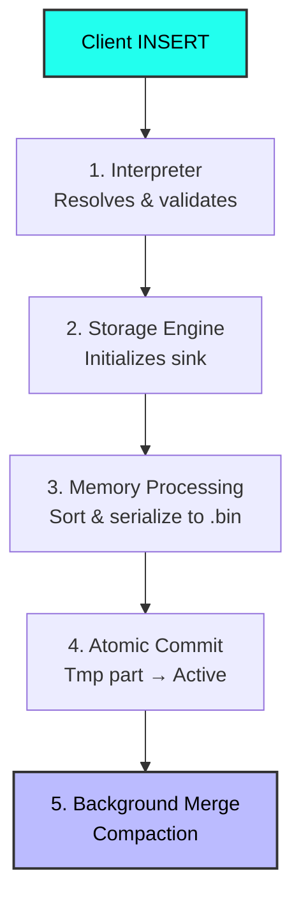

# 🕵️‍♂️ ClickHouse MergeTree: The Write Path Reversed

> **TL;DR:** `INSERT` in ClickHouse *never* writes directly to its final storage. We cracked open the source code to trace a query from the SQL frontend down to the bare disk. 

Here is what we found. This isn't just documentation; this is **live code translating into system design**. By following the code snippets below, you can see exactly how high-level concepts map to actual implementation.

---

## 🗺️ The Path of an `INSERT`



---

## 🔬 The 5-Step Under-the-Hood Journey

### Step 1: Query Entry (The Bridge)
The SQL parser doesn't talk to storage directly. The interpreter acts as the bridge.

**File:** `src/Interpreters/InterpreterInsertQuery.cpp`

```cpp
// InterpreterInsertQuery::execute()
BlockIO InterpreterInsertQuery::execute() {
    ...
    auto out = storage->write(query_ptr, storage->getInMemoryMetadataPtr(), context);
    ...
}
```
👉 **Why?** Decoupling. The storage engine knows nothing about SQL syntax. It just asks for a stream of validated data.

### Step 2: Storage Entry (The Hand-off)
**File:** `src/Storages/MergeTree/StorageMergeTree.cpp`

```cpp
SinkToStoragePtr StorageMergeTree::write(const ASTPtr &, const StorageMetadataPtr & metadata_snapshot, ContextPtr local_context) {
    return std::make_shared<MergeTreeSink>(*this, metadata_snapshot, ...);
}
```
👉 **Why?** ClickHouse uses a push-based data pipeline. `write()` doesn't actually write data; it returns a `Sink`. The execution engine pushes row blocks into this sink lazily.

### Step 3: Block Processing (The Magic Happens)
This is the core. Incoming data gets sorted, compressed, and written to temporary files. Every column gets its own `.bin` file!

**File:** `src/Storages/MergeTree/MergeTreeDataWriter.cpp`

```cpp
// 1. Sort the block IN MEMORY by Primary Key before writing
Block MergeTreeDataWriter::mergeBlock(Block & block, ...) {
    SortDescription sort_description = getSortDescription(metadata_snapshot, context);
    stableGetPermutation(block, sort_description, permutation);
}
```

```cpp
// 2. Build the Sparse Index
void MergeTreeDataWriter::writeIndex(...) {
    // Write just ONE key per index_granularity rows (default: 8,192)
    if (current_row % index_granularity == 0)
        index_granule.push_back(primary_key_value);
}
```

> [!TIP]
> **The Sparse Index Design:** Because the system only stores 1 key per 8,192 rows, a primary index for 8 billion rows fits entirely in RAM (~1M entries). Data sorting makes this possible.

### Step 4: Atomic Commit (Look Ma, No WAL!)
Data is dumped to a `tmp_` directory. How does it become "real"? 

**File:** `src/Storages/MergeTree/MergeTreeData.cpp`

```cpp
void MergeTreeData::renameTempPartAndAdd(MutableDataPartPtr & part, SimpleIncrement * increment, ...) {
    // directory is atomically renamed from tmp_ to final name
}
```
👉 **Why?** Crash safety **without** a Write-Ahead Log (WAL). If power cuts mid-insert, the `tmp_` directory is simply discarded on reboot. Only after a successful atomic directory rename does the data become visible.

### Step 5: Background Merge (The Cleanup Crew)
Parts pile up fast. Background threads pick small parts and merge them together asynchronously to keep reads fast.

**File:** `src/Storages/MergeTree/MergeTreeMergerMutator.cpp`

```cpp
// Select parts to merge based on size/count heuristics
MergeTreeMutationEntry MergeTreeMergerMutator::selectPartsToMerge(...)
```
👉 **Why?** Merging is heavy (CPU/I/O). Doing it in the background keeps your `INSERT` latency insanely low, while read performance organically improves over time.

---

## 🧠 Core Architectural Focus 

We reverse-engineered these core principles directly from the source code structure:

1. **Immutability is everything.** Once a part is committed to disk, it is *never* patched or updated. 
2. **The Filesystem IS the Transaction Log.** Directory renames act as atomic commits. 
3. **Index = Hint.** The primary key doesn't tell you exactly where a row is; it tells you which 8,192-row block it *might* be in.

---

## 💥 Breaking the Flow

What happens when we abuse the system? The code dictates these outcomes:

| Client Action | What the Pipeline does | End Result |
| :--- | :--- | :--- |
| **Many tiny inserts** | Creates 1 temp part per insert, commits individually | Explosion of small parts! 💀<br/>Throws `Too many parts` |
| **Large batch inserts** | Sorts massive block once, writes one big part | Optimal throughput 🚀 |
| **Insert repeated rows** | `deduplicateSelf()` hash match catches it | Block silently dropped, zero duplicates |
