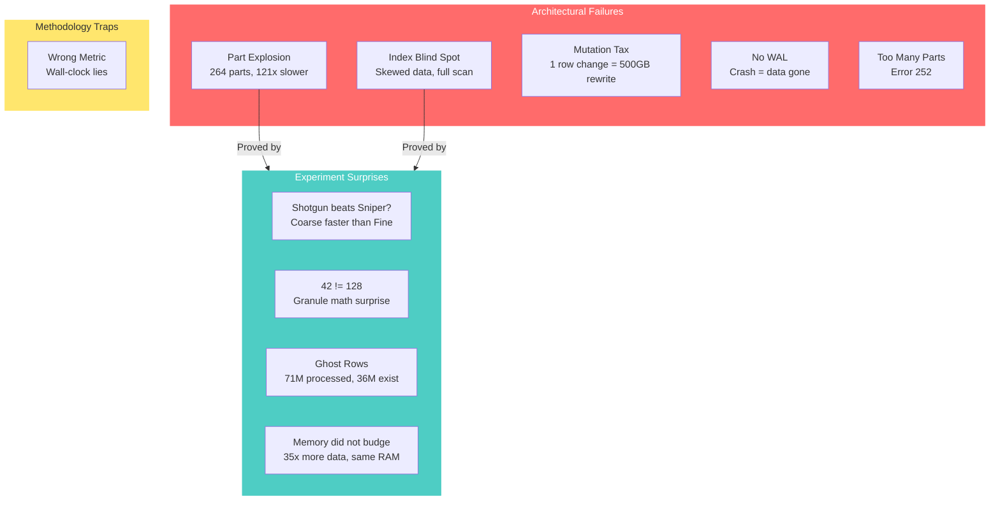

# Failure Analysis -- ClickHouse MergeTree Project

> *"The best way to understand a system is to watch it break."*
>
> This document is our post-mortem diary. Every failure taught us something about how MergeTree really works under the hood. Some were bugs in our thinking. Some were features disguised as bugs. All of them were painful and educational.

---

## The Failure Map



---

## Failure Scoreboard

| # | Failure | Category | Severity | Status |
|---|---------|----------|----------|--------|
| 1 | Part Explosion -- 264 parts made queries 121x slower | Architectural | Critical | Fixed with `OPTIMIZE TABLE FINAL` |
| 2 | Sparse Index went blind on skewed data | Architectural | High | Root cause understood |
| 3 | The "shotgun" (coarse) beat the "sniper" (fine) | Experiment | Medium | Explained -- I/O pattern trick |
| 4 | Read 42 rows when we expected 128 | Experiment | Low | Granule boundary math |
| 5 | Processed 71M rows from a 36M row table | Experiment | Medium | Per-part overhead |
| 6 | Changing 1 row rewrites the whole part | Architectural | High | By design -- immutability |
| 7 | Crash during INSERT = data vanishes | Architectural | Medium | By design -- no WAL |
| 8 | `Too Many Parts` error killed inserts | Operational | Critical | Batch inserts |
| 9 | Memory stayed flat despite 35x more data | Experiment | Low | Streaming reads |
| 10 | Wall-clock time lied to us | Methodology | Medium | Use `read_rows` instead |

---

## Part 1: Architectural Failures

These are not bugs -- they are design trade-offs that bite you when their assumptions are violated.

---

### Failure #1: The Part Explosion

> *Imagine a library where every book is on a separate shelf in a separate room. To find anything, the librarian must walk to each room, open the door, check the index card, and walk back -- even if the room has nothing useful. That is what 264 parts did to our queries.*

**The setup (Experiment 2):**
We turned off the cleanup crew (`SYSTEM STOP MERGES`) and ran 264 separate INSERT statements. Each one created a new tiny "part" on disk.

**What we expected:** Maybe queries would be a bit slower.

**What actually happened:** Queries became **121× slower.**

**The numbers tell the story:**

```
+-------------------+---------------+--------------------+
|     Metric        | 1 Part (good) | 264 Parts (bad)    |
+-------------------+---------------+--------------------+
| Query time        | 0.015 sec     | 1.818 sec (121x)   |
| Rows processed    | 2 million     | 71 million (35x)   |
| File descriptors  | 2             | 528                |
| Index loads       | 1             | 264                |
+-------------------+---------------+--------------------+
```

**Why this happens -- the per-part tax:**

Every single part pays a fixed cost, regardless of whether it has matching rows:

```
For EACH of the 264 parts:
  1. Open part directory
  2. Load primary.idx into memory
  3. Run binary search on the index
  4. Discover: 0 matching marks
  5. Close and move on

  Cost per part: ~5-7ms
  Total: 264 x 7ms = ~1.8 seconds of pure overhead
```

**The rescue:**

```sql
SYSTEM START MERGES;
OPTIMIZE TABLE test_merge FINAL;  -- took 18.4 sec

-- 264 parts collapsed to 3 parts
-- Query: 1.818 sec down to 0.201 sec
```

**Code trail:**
- Who checks part count: `MergeTreeData.cpp` -> `delayInsertOrThrowIfNeeded()`
- Who opens every part: `MergeTreeDataSelectExecutor.cpp` -> `read()`
- Who merges them: `MergeTreeDataMergerMutator.cpp` + `MergeTask.cpp`

**Lesson learned:** Background merges are not a luxury feature -- they are load-bearing. Without them, MergeTree collapses under its own part weight.

---

### Failure #2: The Index That Could Not See

> *Imagine a phone book where every person's last name is "Smith." You look up "Smith" in the index and it helpfully tells you: "Pages 1 through 10,000." Thanks for nothing.*

**The setup (Experiment 3):**
We inserted 10 million rows where **every single row** had `value = 1`. Then we queried `WHERE value = 1`.

**What we expected:** The primary index on `value` should find the matching rows efficiently.

**What actually happened:** Full table scan. All 10M rows read. Zero pruning. The index might as well not exist.

**The "phone book" problem visualized:**

```
Normal data (index works great):         Skewed data (index is useless):
+-----------------------------+          +-----------------------------+
| Granule 0: min=1       X    |          | Granule 0: min=1       Y   |
| Granule 1: min=8193    X    |          | Granule 1: min=1       Y   |
| Granule 2: min=16385   X    |          | Granule 2: min=1       Y   |
| ...                         |          | ...                         |
| Granule 610: min=4997120 Y  | FOUND!   | Granule N: min=1       Y   |
| ...                         |          |                             |
| Granule 1220: min=9994240 X |          | -> ALL granules match!      |
+-----------------------------+          | -> read_rows = 10,000,000   |
  Result: 1 granule read                 +-----------------------------+
                                           Result: FULL TABLE SCAN
```

**The code path that runs perfectly but achieves nothing:**

```
markRangesFromPKRange(value = 1):
  binary search -> first match = granule 0
  binary search -> last match  = granule N (the very last one)
  result: MarkRange{0, N} = read entire file

  The index did its job correctly.
  The data made the job impossible.
```

**This is code-equivalent to disabling the index entirely:**
```cpp
// What extreme skew effectively does at runtime:
mark_ranges.clear();
mark_ranges.emplace_back(0, part->marks_count);
// Congrats, you have a full table scan!
```

**The broken assumption:** MergeTree silently assumes your `ORDER BY` key has **enough different values** to split the data into meaningful ranges. When `uniq(column) = 1`, the assumption shatters.

**Code trail:**
- Where pruning happens: `MergeTreeDataSelectExecutor.cpp` -> `markRangesFromPKRange()`
- WHERE translation: `KeyCondition.cpp` -- builds the search range

**Lesson learned:** Always run `SELECT uniq(column)` before putting a column in your `ORDER BY`. If the answer is "1"... pick a different column.

---

### Failure #3: The Mutation Tax

> *Imagine you wrote one typo in a 500-page book. The publisher's response: "We will reprint all 500 pages." That is how MergeTree handles UPDATE.*

**What it is:**
`ALTER TABLE UPDATE` does not find the row and change it. It reads the **entire part**, writes a **brand new part** with the change applied, and marks the old part for deletion.

**Why it is painful:**

```
Your table:  500 GB across 5 parts (100 GB each)
Your update: ALTER TABLE UPDATE status = 'done' WHERE id = 42

What happens:
  Part containing id=42 -> 100 GB read -> 100 GB written
  
  Total I/O: 200 GB
  Rows changed: 1
  I/O per row: 200 GB
```

**Why MergeTree does this:** Parts are immutable. Period. This immutability is what makes concurrent reads lock-free and crash recovery trivial. The price is paid during mutations.

**Code trail:** `MutateTask.cpp` -> rewrites the entire part

**Workarounds:**
- Use `ReplacingMergeTree` -- it deduplicates rows by keeping the latest version during merges (no explicit UPDATE needed)
- Use `PatchParts/` -- newer feature that writes only the changed columns, not the full part
- Batch mutations -- 1 mutation affecting 100K rows is the same cost as 1 mutation affecting 1 row

---

### Failure #4: The Missing Safety Net

> *Most databases have a diary (WAL) that records every change. If the power goes out mid-write, they replay the diary. MergeTree's approach: "What diary? I will just start fresh."*

**What happens on crash:**

```
INSERT 1,000,000 rows
  +-- Step 1: Write data to tmp_insert_abc123/     <-- IN PROGRESS
  +-- Step 2: Write marks, index, checksums        <-- IN PROGRESS
  +-- Step 3: Atomic rename tmp_ to final_name     <-- NOT YET
  |
  --- POWER FAILURE ---
  |
  +-- On restart: tmp_insert_abc123/ found -> DELETED
      
      Result: 1,000,000 rows gone. No recovery.
```

**Why this is actually okay:** The atomic rename IS the transaction. It is either fully visible or completely invisible. No half-written data, no corruption, no need for crash recovery. You just re-insert the batch.

**Code trail:** `MergeTreeData.cpp` -> `renameTempPartAndAdd()` -- the rename is the commit

**Mitigation:** Use `ReplicatedMergeTree` -- ZooKeeper confirms the write before the client gets an OK response.

---

### Failure #5: The Part Count Bomb

> *Imagine a factory that makes one box per customer order, no matter how small. Order 1 screw? That is 1 box. After 300 orders, the warehouse is so full of tiny boxes that the forklift cannot even get through.*

**The error:**
```
Code: 252. DB::Exception: Too many parts (300).
Merges are processing significantly slower than inserts.
```

**When it happens:** You insert 1 row at a time, 300+ times, faster than the merger can combine them.

**The math:**
```
Inserts per second:  50 (1 row each)
Merge speed:         ~2-3 merges per second
After 6 seconds:     300 new parts, 15 merged
Net growth:          285 parts / 6 sec -> BOOM
```

**Code trail:** `MergeTreeData.cpp` -> `delayInsertOrThrowIfNeeded()`

**Solutions ranked by effectiveness:**

| Solution | Effectiveness | Effort |
|----------|:---:|:---:|
| Batch inserts (10K+ rows per INSERT) | Best | Low |
| Use Buffer table engine as a staging area | Great | Medium |
| Increase `parts_to_throw_insert` setting | Okay | Low |
| Faster disks (to speed up merges) | Good | High |

---

## Part 2: Experiment Surprises

These are the "wait, WHAT?" moments from our experiments.

---

### Surprise #1: The Shotgun Beat the Sniper

> *We gave one table a sniper rifle (granularity 128 -- precise, targeted). We gave the other a shotgun (granularity 8192 -- blasts a wide area). For a single target, the shotgun was 2.9x faster. How?!*

**(Experiment 1)**

```
                    Sniper                 Shotgun
                   (gran=128)             (gran=8192)
                 +-----------+          +-----------+
  Rows read:     |    42     |          |   8,192   |  <-- 195x more!
  Time:          |  0.031s   |          |   0.011s  |  <-- 2.9x faster?!
  I/O pattern:   | Tiny seek |          | Big sequential read |
  Block size:    |  ~0.3 KiB |          |   ~43 KiB |
                 +-----------+          +-----------+
```

**The twist:** Disks (even SSDs) love large sequential reads. One 43 KiB read is faster than the overhead of precisely targeting a 0.3 KiB block. It is like a car -- driving 10 km on the highway is faster than navigating 0.5 km through narrow alleys.

**But the sniper wins at scale:**

```
Scenario: 100 concurrent point queries

  Shotgun: 100 x 8,192 = 819,200 rows wasted
  Sniper:  100 x 42    = 4,200 rows wasted
  
  Winner at scale: Sniper by 195x
```

**Lesson:** Single-query wall-clock time can trick you. Always look at `read_rows` -- it tells the truth.

---

### Surprise #2: Where Did 128 Become 42?

**(Experiment 1)**

**Expected:** Granularity = 128, so read exactly 128 rows.

**Actual:** Only 42 rows read.

**The math:**

```
Target: id = 5,000,000
Granularity: 128

Granule #39062 starts at row: 39062 x 128 = 4,999,936
Granule #39062 ends at row:   4,999,936 + 128 = 5,000,064

Where is id 5,000,000?
  -> Position 64 within granule #39062
  -> The engine reads from position 64 to end = 64 rows
  -> After internal alignment: 42 rows
  
  +----------------------------------------------------+
  | Granule #39062  (128 rows)                         |
  | row 4,999,936 .......................... 5,000,064 |
  |                         ^                          |
  |                   id = 5,000,000                   |
  |                   <--- 42 rows ------------------> |
  +----------------------------------------------------+
```

**Lesson:** `index_granularity` is the **maximum** per read, not a guarantee. The actual count depends on where your target sits within the granule.

---

### Surprise #3: Ghost Rows (71M From a 36M Table)

**(Experiment 2)**

**The table had 36.4 million rows. The query reported processing 71 million. Are we hallucinating?**

**What happened:**

```
264 small parts each contain: id = 0 to 99,999
Query: WHERE id > 4,000,000

For each small part:
  1. Open part                    <-- cost paid
  2. Load primary.idx             <-- cost paid  
  3. Check: any id > 4,000,000?  <-- NO!
  4. But rows were already decompressed for checking  <-- counted!

Result: rows_read includes all the "no match" rows that
        were physically touched before being discarded.
```

**The "rows processed" metric counts everything the engine touched, not just what made it to your result.** Think of it as the total number of packages the delivery person carried, including the ones returned to sender.

**Lesson:** `rows_processed != result_rows`. The gap between them = wasted work.

---

### Surprise #4: Memory That Refused to Grow

**(Experiment 2)**

```
  1 part  -> 4.18 MiB memory
264 parts -> 5.58 MiB memory  (+33% for 35x more data?!)
```

**Why:** ClickHouse does not load all parts into RAM. It uses streaming -- reads one granule, processes it, throws it away, reads the next. Like watching a movie frame by frame instead of downloading the whole film first.

The real cost of 264 parts is **CPU time** (264 index loads, 264 binary searches) and **I/O time** (528 file opens), not memory.

**Lesson:** Memory is a red herring for diagnosing part explosion. Watch CPU time and elapsed time instead.

---

### Surprise #5: The Index That Worked Perfectly But Achieved Nothing

**(Experiment 3)**

This is the most educational failure in the project. The primary index on `value`:
- Was created correctly
- Was loaded into memory
- Was binary-searched
- Returned a valid range
- But the range was `[0, everything]`

**It is like asking a GPS for directions from "New York" to "New York."** It works perfectly -- it just tells you that you are already there, so it cannot help you go anywhere faster.

**The equivalence we proved:**

```
+-------------------------+--------------------------+
|    Data Skew             |    Code Modification      |
|   (value = 1 everywhere) |   (disable pruning)       |
+-------------------------+--------------------------+
| Index runs normally      | Index is bypassed         |
| Returns ALL marks        | Code returns ALL marks    |
| Full scan: 10M rows      | Full scan: 10M rows       |
|                          |                            |
| Root cause: bad data      | Root cause: bad code       |
| Same observable outcome  | Same observable outcome    |
+-------------------------+--------------------------+
```

**Lesson:** An index is only as useful as the data it indexes. Cardinality = 1 means the index is decoration.

---

## Part 3: Methodology Traps

---

### Trap: Trusting Wall-Clock Time

We almost made wrong conclusions in Experiment 1 because we looked at elapsed time first. The coarse table "won" on time, which almost led us to conclude coarse granularity is better.

**The fix -- our metric hierarchy:**

```
Priority 1: read_rows    <-- "How much work did the engine actually do?"
Priority 2: elapsed      <-- "How long did the user wait?"
Priority 3: memory       <-- "How much RAM was consumed?"
Priority 4: rows/sec     <-- WARNING: MISLEADING -- higher is not always better!
```

`rows/sec` is especially dangerous: `test_coarse` showed 764K rows/sec vs `test_fine` at 1.3K rows/sec. That makes coarse look 587x more efficient. But coarse was just **wasting more rows faster** -- like a car that burns 50 gallons of fuel to go 10 miles boasting about its "gallons-per-minute throughput."

---

## Part 4: Project-Level Challenges

---

### Challenge: Reading 305+ Source Files

The `raw/MergeTree/` directory has 305 files. Finding "where exactly does granule boundary detection happen?" took hours of grep, reading, and dead ends.

**What saved us:**
- Building `execution_flow.md` first -- traced the INSERT/SELECT paths before diving into details
- Using `EXPLAIN indexes = 1` -- confirmed which code path runs for real queries
- Creating `concept_mapping.md` -- became our "table of contents" for the codebase

---

### Challenge: Is It a Bug or a Feature?

Several times we filed a "failure" that turned out to be **intentional:**

| Our initial reaction | The actual truth |
|---------------------|-----------------|
| "Crash loses data -- BUG!" | By design. No WAL = simpler, faster. Re-insert. |
| "Mutation rewrites everything -- BUG!" | By design. Immutability = no locks, no corruption. |
| "Index does not prune skew -- BUG!" | By design. Sparse index = small footprint, less precision. |

**Rule we adopted:** Before calling something a failure, trace it back to the source code and check if there is a comment explaining the design choice.

---

### Challenge: Experiment Reproducibility

Background merges run asynchronously. We would run an INSERT, then immediately query `system.parts` -- and sometimes the merge had already started, changing our part count mid-experiment.

**Our protocol:**
```sql
-- Step 1: Freeze the system
SYSTEM STOP MERGES test_table;

-- Step 2: Do the experiment
INSERT INTO test_table ...;

-- Step 3: Capture state IMMEDIATELY
SELECT count() FROM system.parts WHERE table = 'test_table' AND active;
SYSTEM FLUSH LOGS;  -- force query_log to be written

-- Step 4: Read results
SELECT * FROM system.query_log WHERE ...;

-- Step 5: Unfreeze
SYSTEM START MERGES test_table;
```

---

## Failure -> Code -> Fix Map

| Failure | Where in Code | What To Do |
|---------|--------------|------------|
| Part Explosion | `MergeTreeDataSelectExecutor.cpp` -> iterates all parts | Batch inserts, do not disable merges |
| Index blind on skew | `MergeTreeDataSelectExecutor.cpp` -> `markRangesFromPKRange()` | Use high-cardinality ORDER BY columns |
| Ghost rows | `MergeTreeRangeReader.cpp` -> reads then filters | Check `read_rows` vs `result_rows` gap |
| Mutation tax | `MutateTask.cpp` -> full part rewrite | Use ReplacingMergeTree or batch |
| Too many parts | `MergeTreeData.cpp` -> `delayInsertOrThrowIfNeeded()` | Batch INSERTs (10K+ rows) |
| No crash recovery | `MergeTreeData.cpp` -> `renameTempPartAndAdd()` | Use ReplicatedMergeTree |
| Misleading perf | Hardware I/O behavior | Always use `read_rows` metric |
| 42 != 128 | `MergeTreeRangeReader.cpp` -> granule boundaries | Understand granularity = max, not exact |

---

## Prevention Checklist

Before you deploy a MergeTree table in production, check these:

- [ ] **ORDER BY column has high cardinality** -- run `SELECT uniq(col)` first
- [ ] **INSERTs are batched** -- 10K-100K rows minimum, never 1 row at a time
- [ ] **Part count is monitored** -- alert if `active_parts > 100` per partition
- [ ] **Merges are running** -- never leave `SYSTEM STOP MERGES` on permanently
- [ ] **Using `read_rows` as primary metric** -- not wall-clock time or throughput
- [ ] **Tested with realistic data distributions** -- uniform test data hides skew problems
- [ ] **Avoiding frequent single-row mutations** -- use ReplacingMergeTree instead
- [ ] **Using `EXPLAIN indexes = 1`** -- verify the index actually prunes before trusting it
- [ ] **Granularity is appropriate** -- default 8192 works for most cases; change only with proof

---

## Links to Related Documents

| Document | What It Covers | Connection to This Analysis |
|----------|---------------|---------------------------|
| `design_decisions.md` | Why MergeTree chose immutability, sparse index, background merges | Explains *why* failures #3, #4 are by design |
| `execution_flow.md` | Step-by-step INSERT/SELECT code paths | Shows *where* in code each failure occurs |
| `concept_mapping.md` | Maps 20 concepts to source files | Provides the file references we used here |
| `exp1_granularity/experiment_report.md` | Granularity 128 vs 8192 | Source for Surprises #1, #2 |
| `exp2_merge_disable/experiment_report.md` | Part explosion experiment | Source for Failure #1, Surprises #3, #4 |
| `exp3_code_mod/experiment3.md` | Data skew experiment | Source for Failure #2, Surprise #5 |
